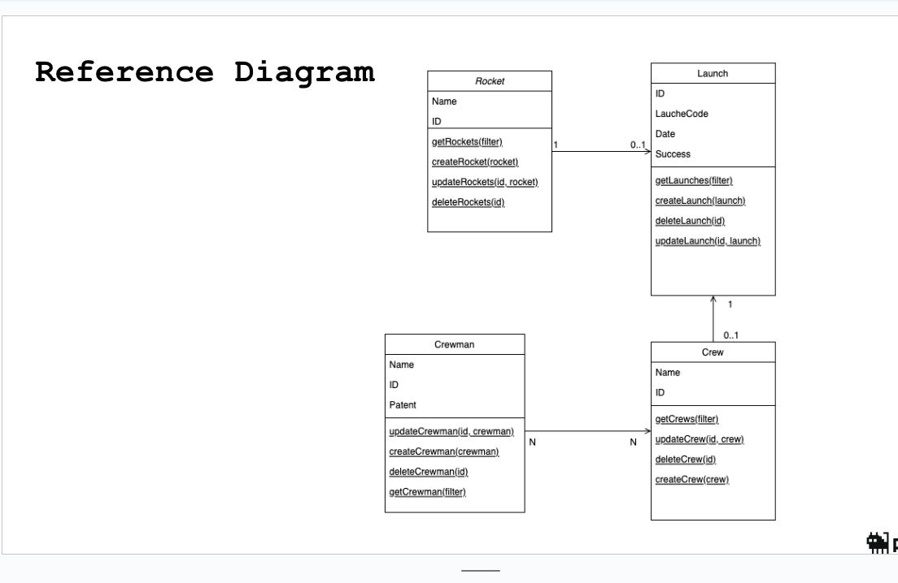
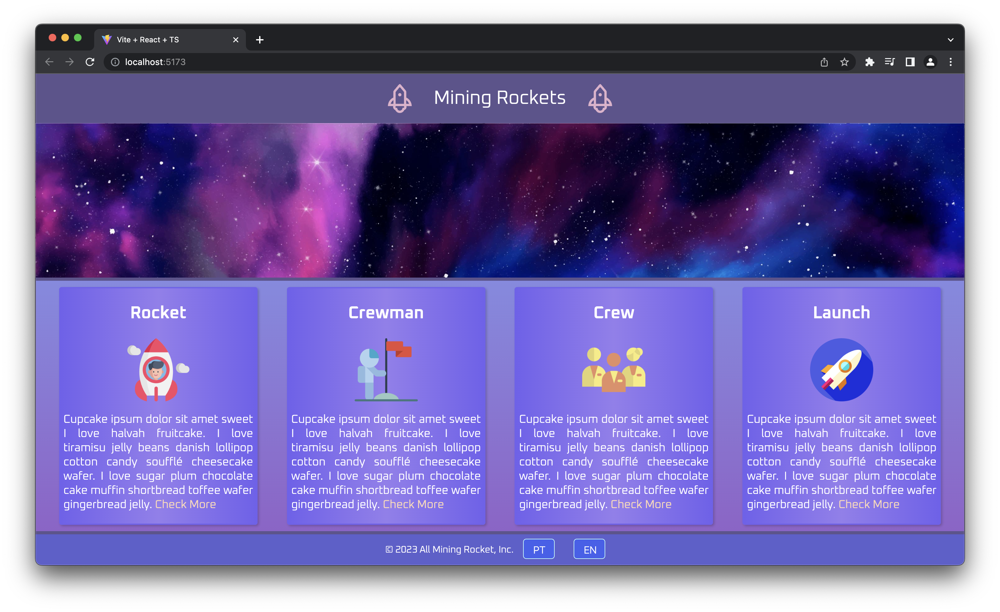
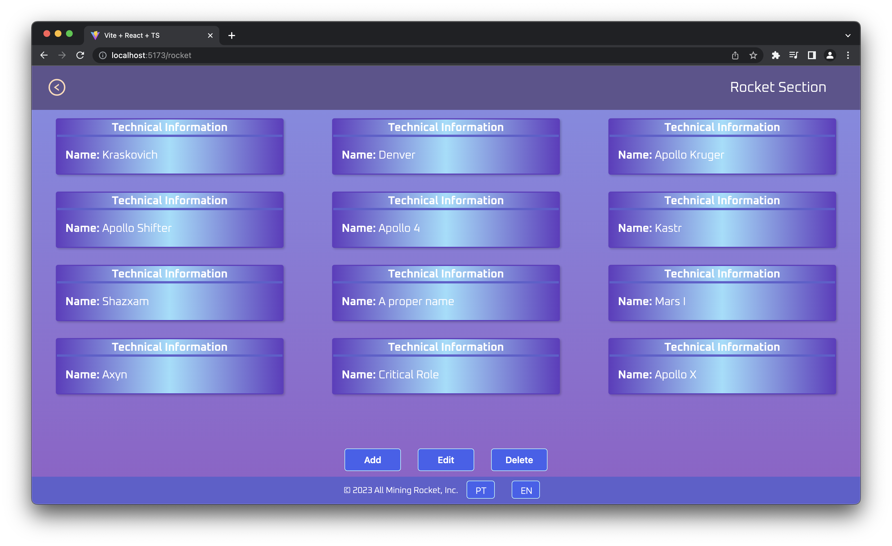
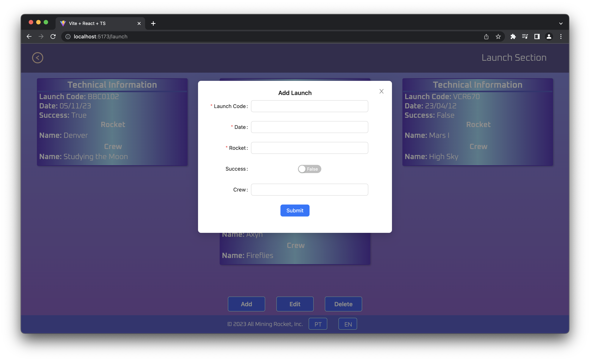

<!-- Improved compatibility of back to top link: See: https://github.com/othneildrew/Best-README-Template/pull/73 -->
<a name="readme-top"></a>
<!--
*** Thanks for checking out the Best-README-Template. If you have a suggestion
*** that would make this better, please fork the repo and create a pull request
*** or simply open an issue with the tag "enhancement".
*** Don't forget to give the project a star!
*** Thanks again! Now go create something AMAZING! :D
-->


<!-- PROJECT SHIELDS -->
<!--
*** I'm using markdown "reference style" links for readability.
*** Reference links are enclosed in brackets [ ] instead of parentheses ( ).
*** See the bottom of this document for the declaration of the reference variables
*** for contributors-url, forks-url, etc. This is an optional, concise syntax you may use.
*** https://www.markdownguide.org/basic-syntax/#reference-style-links
-->


<!-- PROJECT LOGO -->
<br />
<div align="center">
<!--   <a href="https://github.com/othneildrew/Best-README-Template">
    
  </a> -->

  <h3 align="center">Mining Rockets</h3>

  <p align="center">
    An application to manage your own space station!
<!--     <br />
    <a href="https://github.com/othneildrew/Best-README-Template"><strong>Explore the docs »</strong></a> -->
    <br />
    <br />
    <a href="https://github.com/erianalves-plank/rocket-system-frontend/issues">Report Bug</a>
    ·
    <a href="https://github.com/erianalves-plank/rocket-system-frontend/issues">Request Feature</a>
  </p>
</div>


<!-- TABLE OF CONTENTS -->
<details>
  <summary>Table of Contents</summary>
  <ol>
    <li>
      <a href="#about-the-project">About The Project</a>
      <ul>
        <li><a href="#built-with">Built With</a></li>
      </ul>
    </li>
    <li>
      <a href="#getting-started">Getting Started</a>
      <ul>
        <li><a href="#installation">Installation</a></li>
      </ul>
    </li>
    <li><a href="#usage">Usage</a></li>
    <li><a href="#roadmap">Roadmap</a></li>
    <li><a href="#contact">Contact</a></li>

  </ol>
</details>


<div align="justify">
<div>

<!-- ABOUT THE PROJECT -->
## About The Project

This project intends to be a solution for all the people who wants to easily plan and manage their own space institute or organization but don't know how to start. Mining Rockets is an application dedicated to solving this problem. Build with the latest technologies, it allows the user to register, edit and delete a set of entities that are the foundation of a space organization. The entities covered are: Rocket, Crewman, Crew and Launch. 

A good view on the relationship of these elements can be observed on the schematics below.

<div align="center">
  <a href="https://github.com/othneildrew/Best-README-Template">
    
  </a>
<div>

<p align="right">(<a href="#readme-top">back to top</a>)</p>

<div align="justify">
<div>

## Built With

As mentioned above, this project is build with the latest technologies on the industry. The following list present the frameworks/libraries used:


<div align="left">

* [![Vite][Vite.js]][Vite-url]
* [![React][React.js]][React-url]
* [![Cypress][Cypress]][Cypress-url]
* [![ESLint][ESLint]][ESLint-url]
* [![Jest][Jest]][Jest-url]
* [![StoryBook][StoryBook]][StoryBook-url]
* [![Prettier][Prettier]][Prettier-url]
* [![i18next][i18next]][i18next-url]
* [![Axios][Axios]][Axios-url]
* [![AntDesign][AntDesign]][AntDesign-url]
</div>


<p align="right">(<a href="#readme-top">back to top</a>)</p>


<!-- GETTING STARTED -->
## Getting Started

The next section breaks step to step on how to set up the project locally.

### Installation


1. Clone the repo and enter the project folder
   ```sh
   git clone https://github.com/erianalves-plank/rocket-system-frontend.git
   cd rocket-system-frontend
   ```
2. Install NPM packages
   ```sh
   npm install
   ```
3. Get the project running
   ```sh
   npm run dev
   ```
> Note: For the current moment, it is being used the development backend. So just cloning this repo and running the commands above won't get the application working with it's full capability.


### Running tests and documentation

* Running e2e and component tests with cypress
   ```sh
    npm run cy:open
   ```
* Running unit tests with jest
   ```sh
    npm run test
   ```
* Running storybook
   ```sh
    npm run storybook
   ```

<p align="right">(<a href="#readme-top">back to top</a>)</p>


<!-- USAGE EXAMPLES -->
## Usage

<div align="center">
    
    
    
<div>

<p align="right">(<a href="#readme-top">back to top</a>)</p>


<div align="justify">
<div>

<!-- ROADMAP -->
## Roadmap

- [ ] Finish Unit tests
- [ ] Change connection to production backend
- [ ] Deploy to vercel
- [ ] Multi-language Support
- [ ] Spanish

See the [open issues](https://github.com/erianalves-plank/rocket-system-frontend/issues) for a full list of proposed features (and known issues).

<p align="right">(<a href="#readme-top">back to top</a>)</p>


<!-- CONTACT -->
## Contact

Project Link: [https://github.com/erianalves-plank/rocket-system-frontend](https://github.com/erianalves-plank/rocket-system-frontend)

<p align="right">(<a href="#readme-top">back to top</a>)</p>


<!-- MARKDOWN LINKS & IMAGES -->
<!-- https://www.markdownguide.org/basic-syntax/#reference-style-links -->
[React.js]: https://img.shields.io/badge/React-20232A?style=for-the-badge&logo=react&logoColor=61DAFB
[React-url]: https://reactjs.org/
[Vite.js]: https://img.shields.io/badge/Vite.js-000000?style=for-the-badge&amp;logo=vite&amp;logoColor=white
[Vite-url]: https://vitejs.dev/
[Cypress-url]: https://www.cypress.io/
[Cypress]: https://img.shields.io/badge/Cypress-17202C?style=for-the-badge&logo=cypress&logoColor=white
[Jest-url]: https://jestjs.io/
[Jest]: https://img.shields.io/badge/Jest-C21325?style=for-the-badge&logo=jest&logoColor=white
[StoryBook-url]: https://storybook.js.org/
[StoryBook]: https://img.shields.io/badge/Storybook-FF4785?style=for-the-badge&logo=storybook&logoColor=white
[ESLint-url]: https://eslint.org/
[ESLint]: https://img.shields.io/badge/ESLint-4B32C3?style=for-the-badge&logo=eslint&logoColor=white
[Prettier-url]: https://prettier.io/
[Prettier]: https://img.shields.io/badge/Prettier-F7B93E?style=for-the-badge&logo=prettier&logoColor=white
[AntDesign-url]: https://ant.design/
[AntDesign]: https://img.shields.io/badge/Ant_Design-0170FE?style=for-the-badge&logo=ant-design&logoColor=white
[i18next-url]: https://www.i18next.com/
[i18next]: 	https://img.shields.io/badge/i18next-1383C5?style=for-the-badge&logo=i18next&logoColor=white
[Axios-url]: https://axios-http.com/
[Axios]: https://img.shields.io/badge/Axios-0098D0?style=for-the-badge&logo=axios&logoColor=white

